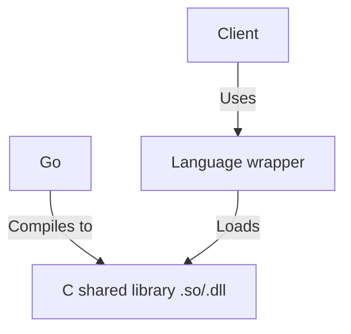
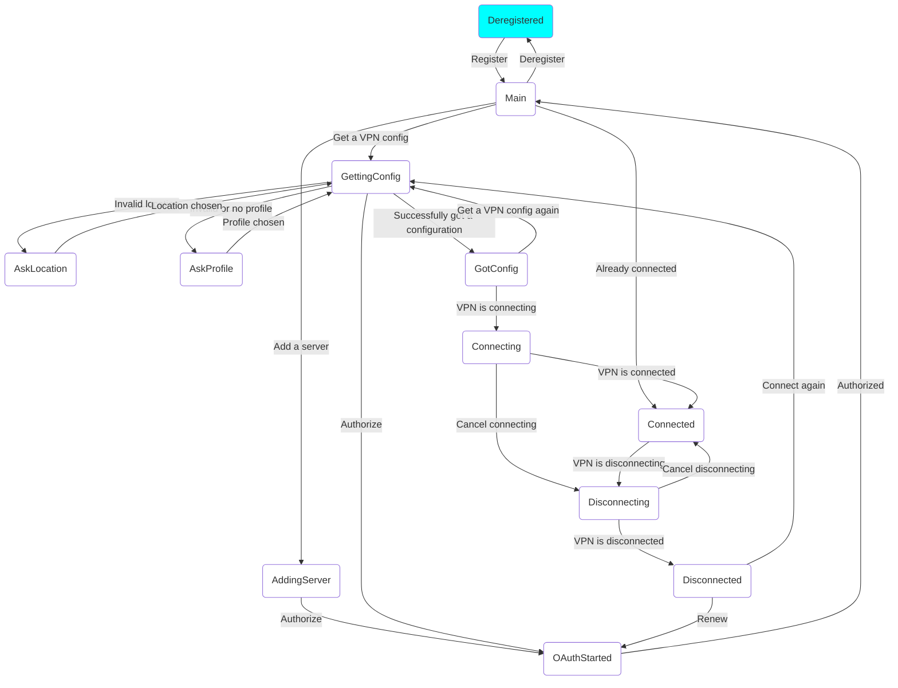

# Building a client

This chapter is a high-level overview on how to use eduvpn-common and build your own eduVPN/Let's Connect! client. In this chapter, we go over the basics of how the interop between Go and language x works, say something about the architecture, explain where to find detailed API documentation, explain the state machine, give a typical flow for a client and give a follow along tutorial on building an eduVPN client using Python code. At last, we will also have a few code examples that can be used as a short reference.

## Go <-> language X interop
Because this library is meant to be a *general* library for other clients to use that are written in different programming languages, we need to find a way to make this Go library available on each platform and codebase. The approach that we take is to build a C library from the Go library using Cgo. Cgo can have its disadvantages with performance and the constant conversion between Go and C types. To overcome those barriers, this library has the following goals (with some others noted here):

- **Be high-level**. Functions should do as much as possible in Go. The exported API should fit in one file. Lots of low-level functions would be a constant conversion between C and Go which adds overhead
- **Move as much state to Go as possible**. For example, Go keeps track of the servers you have configured and discovery. This makes the arguments to functions simple, clients should pass simple identifiers that Go can look up in the state
- **Easy type conversion**: to convert between C and Go types, JSON is used. Whereas Protobuf, Cap'n'proto or flatbuffers are more performant, they are harder to debug, add thousands of lines of autogenerated code and are not human friendly. Using JSON, the clients can approach it the same way they would use with a server using a REST API. Another approach is to just  convert from Go -> C types -> language types. This was tried in version 1 of the library, but this ended up being too much work and manual memory management
- **Make it as easy as possible for clients to manage UI and internal state**: we use a state machine that gives the clients information in which state the Go library is in, e.g. we're selecting a server profile, we're loading the server endpoints. This library is not only a layer to talk to eduVPN servers, but the whole engine for a client
- **Implement features currently not present in existing clients**: WireGuard to OpenVPN failover, WireGuard over TCP
- **Follow the official eduVPN specification** and also contribute changes when needed
- **Secure**: We aim to follow the latest OAuth recommendations, to not store secret data and e.g. disable OpenVPN scripts from being ran by default

And finally the most important goal:

- **The advantages that this library brings for clients should outweigh the cost of incorporating it into the codebase**. Initial versions would take more work than we get out of it. However, when each eduVPN/Let's Connect! client uses this library we should expect a net gain. New features should be easier to implement for clients by simply requiring a new eduvpn-common version and using the necessary functions

## Architecture
In the previous section, we have already hinted a bit on the exact architecture. This section will expand upon it by giving a figure of the basic structure



As can be seen by this architecture, there is an intermediate layer between the client and the *shared* library. This wrapper eases the way of loading this library and then defining a more language specific API for it. In the eduvpn-common repo, we currently only support a Python wrapper. Clients themselves can define their own wrapper

## Typical flow for a client
> **_NOTE:_** This uses the function names that are defined in the exports file in Go. For your own wrapper/the Python wrapper they are different. But the general flow is the same

1. The client starts up. It calls the `Register` function that communicates with the library that it has initialized
2. It gets the list of servers using `ServerList`
3. When the user selects a server to connect to in the UI, it calls the `GetConfig` to get a VPN configuration for this server. This function transitions the state machine multiple times. The client uses these state transitions for logging or even updating the UI. The client then connects

	- New feature in eduvpn-common: Check if the VPN can reach the gateway after the client is connected by calling `StartFailover`

4. If the client has no servers, or it wants to add a new server, the client calls `DiscoOrganizations` and `DiscoServers` to get the discovery files from the library. This even returns cached copies if the organizations or servers should not have been updated [according to the documentation](https://docs.eduvpn.org/server/v3/server-discovery.html)

	- From this discovery list, it calls `AddServer` to add the server to the internal server list of eduvpn-common. This also calls necessary state transitions, e.g. for authorizing the server. The next call to `ServerList` then has this server included
	- It can then get a configuration for this server like we have explained in *step 3*

5. When a configuration has been obtained, the internal state has changed and the client can get the current server that was configured using `CurrentServer`. `CurrentServer` can also be called after startup if a server was previously set as the current server
6. When the VPN disconnects, the client calls `Cleanup` so that the server resources are cleaned up by calling the `/disconnect` endpoint
7. A server can be removed with the `RemoveServer` function
8. When the client is done, it calls `Deregister` such that the most up to date internal state is saved to disk. Note that eduvpn-common also saves the internal state .e.g. after obtaining a VPN configuration

## Finite state machine

The eduvpn-common library uses a finite state machine internally to keep track of which state the client is in and to communicate data callbacks (e.g. to communicate the Authorization URL in the OAuth process to the client).

### FSM example
The following is an example of the FSM when the client has obtained a Wireguard/OpenVPN configuration from an eduVPN server



The current state is highlighted in the <span style="color:cyan">cyan</span> color.

### State explanation

For the explanation of what all the different states mean, see the [client documentation](https://codeberg.org/eduVPN/eduvpn-common/src/branch/main/client/fsm.go#L22-L58)

### States that ask data

In eduvpn-common, there are certain states that require attention from the client.

- OAuth Started: A state that must be handled by the client. How a client can 'handle' this state, we will see in the next section. In this state, the client must open the webbrowser with the authorization URL to complete to OAuth process. Note that on mobile platforms, you also need to reply with the authorization URI as these platforms do not support a local callback server using 127.0.0.1
- Ask Profile: The state that asks for a profile selection to the client. Reply to this state by using a "cookie" and the CookieReply function. What this means will be discussed in the Python client example too
- Ask Location: Same for ask profile but for selecting a secure internet location. Only called if one must be chosen, e.g. due to a selection that is no longer valid

The rest of the states are miscellaneous states, meaning that the client can handle them however it wants to. However, it can be useful to handle most state transitions to e.g. show loading screens or for logging and debugging purposes.

## Code examples
This chapter contains code examples that use the API

### Go command line client
The following is an example [in the repository](https://codeberg.org/eduVPN/eduvpn-common/src/branch/main/cmd/cli/main.go). It is a command line client with the following flags
```
  -get-custom string
        The url of a custom server to connect to
  -get-institute string
        The url of an institute to connect to
  -get-secure string
        Gets secure internet servers
```
```go
{{!cmd/cli/main.go!}}
```

